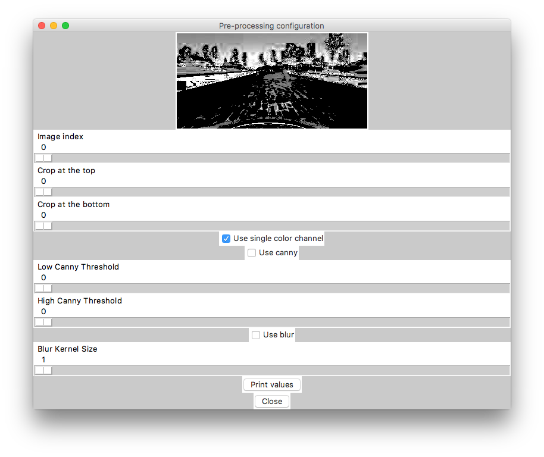
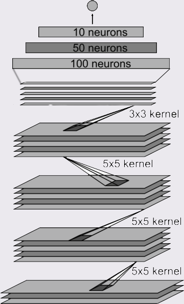

#Behavioural Cloning

Behavioral Cloning Project

The goals / steps of this project are the following:

* Use the simulator to collect data of good driving behavior
* Build, a convolution neural network in Keras that predicts steering angles from images
* Train and validate the model with a training and validation set
* Test that the model successfully drives around track one without leaving the road
* Summarize the results with a written report

##Rubric Points


### 1. Submission includes all required files and can be used to run the simulator in autonomous mode

My project includes the following files:

* `model.py` - containing the script to create and train the model
* `drive.py` - for driving the car in autonomous mode
* `preprocess.py` - file with shared code to read the information and pre-process the training data
* `preprocess_gui.py` - a GUI application I have written to help me visualise the training process
* `model.h5` - containing a trained convolution neural network
* `write_up.md` - summarizing the results


### 2. Submission includes functional code

Using the Udacity provided simulator and my drive.py file, the car can be driven autonomously around the track by executing

```
python drive.py model_with_color.h5
```

###3. Submission code is usable and readable

The `model.py` file contains the code for training and saving the convolution neural network. The file shows the pipeline I used for training and validating the model, and it contains comments to explain how the code works. 

The `preprocess.py` file contains the code to read the training data and pre-process it before it is sent to for training. This file also contains a shared function which is used by `model.py` and `drive.py` file to make sure that the same image processing is applied during training and driving. File contains a large amount of comments to explain how it works.

The `preprocess_gui.py` file contains a GUI application to visualise the image processing used during the training. I used this file to tune parameters like thresholds for canny algorithm and others.

##Model Architecture and Training Strategy

###1. An appropriate model architecture has been emplyed.

My model consist of a convolution neural network with 3x3 and 5x5 filter sizes (`model.py` lines 20-25 and 35-41)

The model is also usen a `Flatter` layer after the convolutional layers (line 35), dropout to avoid overfitting (line 36) and multiple dense layers (lines 37 - 41).

All of the data is normalized prior to training, so I don't have any normalization layers.

###2. Attempts to reduce overfitting in the model.

I've used the dropout layer on line 36, I drop 25% of the data during the dropout.

###3. Model parameter turning.

The model used an adam optimizer, so the learning rate was not tuned manually (line 43).

###4. Appropriate training data.

I've tried to record the training data using a driving wheel, but I didn't have much success with it. Instead I ended up using the training data provided by Udacity. I increase the amount of data by using all three cameras (left, center and right), I adjust the angles by `0.25` gradient for the side cameras.

I also flip all of the images and angles to double the training size. At the end I ended up having 38,572 sample of the training data.

I use computer vision to pre-process each image, I cover the details lower in this file.

##Model Architecture and Training Strategy

###1. Solution Design Approach
I based my solution on the network structure designed by Nvidia. However, because I'm removing the color during the pre-processing I lost the third dimension, so instead of using `Convlution2D` layers I ended up using `Convolution1D` layers of the same size.

The biggest challenge for my car was the corner right after the bridge. Instead of turning left my car was insisting on going straight. I've tried collecting more data, but it didn't help. 

In the end I ended up using some of the computer vision concepts we were taught during the first and the fourth projects. Specifically I preprocess the images in the following way:

1. I convert the images to HLS color space.
2. I remove every other channel, but "H"
3. I threshold all of the colors between `0` and `80` to black, and end up with the following result:



4. 

###2. Final Model Architecture

The final model architecture is a convlutional neural network with the following layers:
1. Convolution 1D layer with 5x5 size
2. Convolution 1D layer with 5x5 size
4. Convolution 1D layer with 3x3 size
5. Convolution 1D layer with 3x3 size
6. Flatten layer
7. Dropout with %25 chance
9. Dense with 100 elements
10. Dense with 50 elements
11. Dense with 10 elements
12. Dense with 1 element for regression.

Visualization of the network:



During the training I load previous weights, then split the data set and leave 80% for training and 20% for validation and I also shuffle the traning set to ensure the best results.

The training is taking between 13 and 15 seconds per epoch. My training loss is around `0.0215` and my validation loss is around `0.0280`, which is not very high and more importantly, close to each other.

Here is the video of my car completing the first track:

